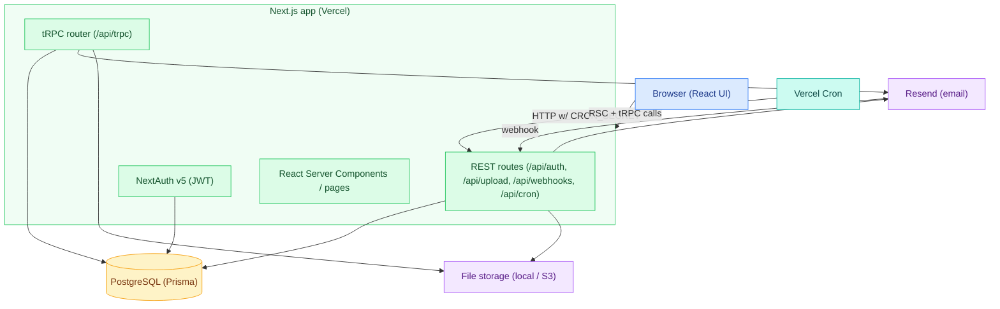
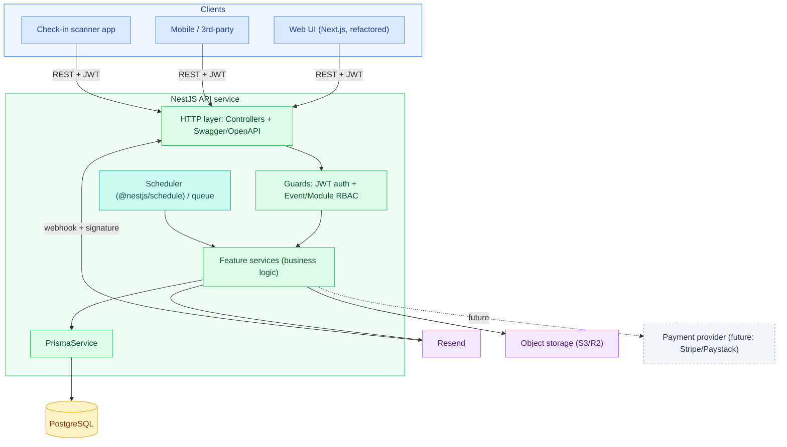
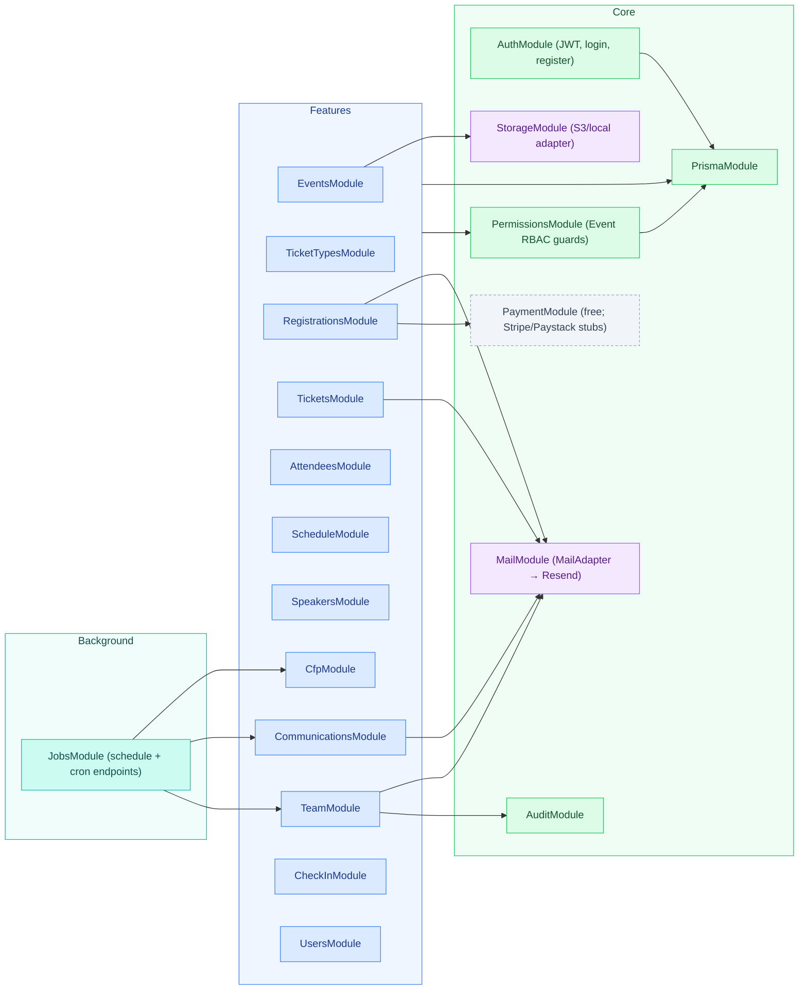
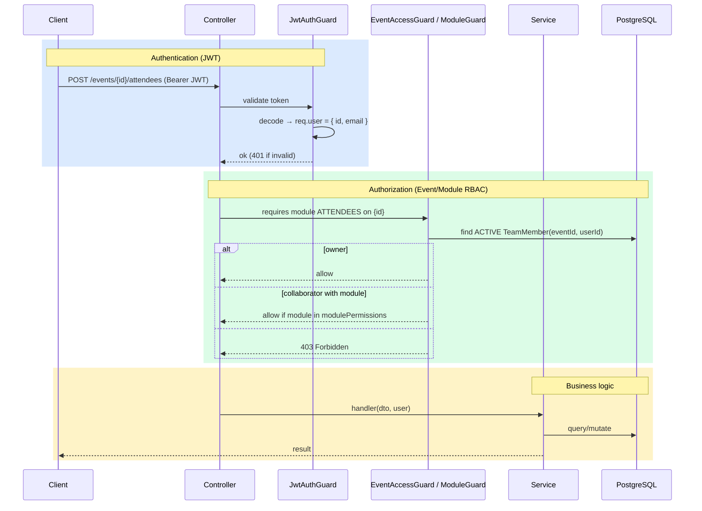
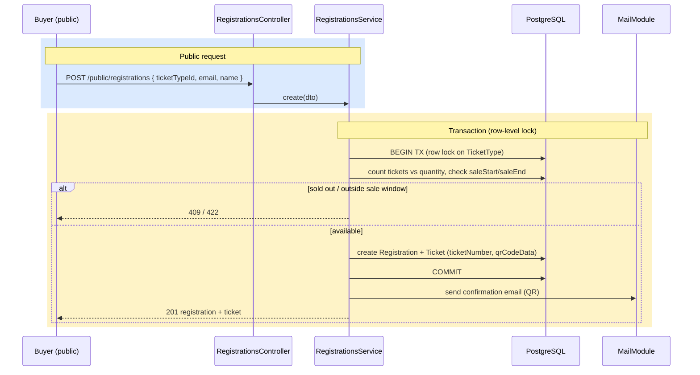
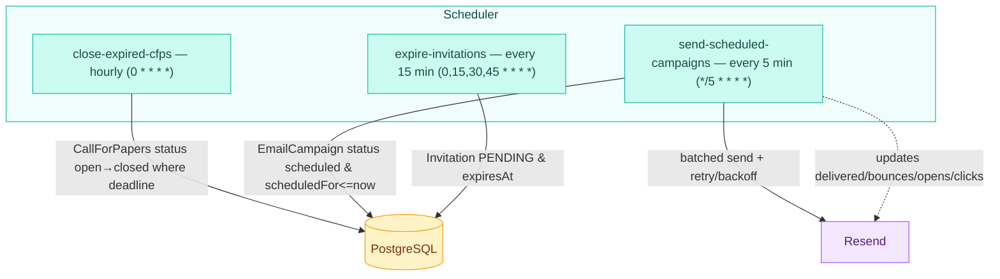
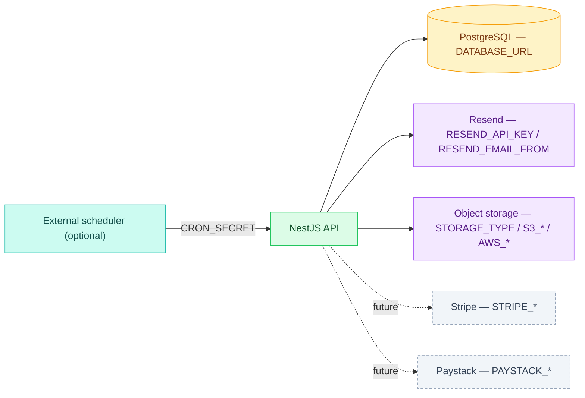

# Architecture — Standalone API (NestJS target)

This document describes the architecture of the standalone API extracted from the
existing Next.js/tRPC application, expressed as a **NestJS** service. It covers the
current (source) architecture, the target architecture, the module decomposition,
request/permission flows, and the background jobs.

**Diagram legend** — nodes are colour-coded by role: 🟦 **clients / feature modules**
(blue), 🟩 **NestJS app & core providers** (green), 🟧 **datastore — PostgreSQL** (amber),
🟪 **external services — Resend, storage** (purple), **background jobs / scheduler** (teal),
and **future / dormant — payments, Stripe/Paystack** (dashed slate).

---

## 1. Current vs. target

### Current (source) — Next.js monolith



UI and API are co-deployed; the API is reachable only via tRPC's TypeScript client and a
handful of REST routes.

### Target — standalone NestJS API



Key shifts:
- tRPC procedures become **REST controllers** documented by an OpenAPI/Swagger spec.
- NextAuth is replaced by a **first-party JWT auth module** (reusing the bcrypt `password` hash on `User`).
- Vercel Cron HTTP endpoints become **in-process scheduled jobs** (`@nestjs/schedule`), or remain HTTP-triggered if you keep an external scheduler.
- The email delivery webhook handler stays (now provider-agnostic, `POST /webhooks/email`), but **signature verification must be implemented** in the mail adapter (it is a TODO in the source).

---

## 2. Module decomposition (NestJS)

Each tRPC router maps to a NestJS feature module. Shared concerns (auth, permissions,
email, storage, payments, prisma) become injectable providers.



| NestJS module | From router/route | Primary entities |
|---|---|---|
| AuthModule | `/api/auth/*`, NextAuth | User, (Account/Session optional) |
| UsersModule | `user` | User |
| EventsModule | `event` | Event |
| TicketTypesModule | `ticket` | TicketType |
| RegistrationsModule | `registration` | Registration, Ticket, Attendee |
| TicketsModule | `tickets` | Ticket, Attendee |
| AttendeesModule | `attendees` | Attendee (+ CSV import) |
| ScheduleModule | `schedule` | ScheduleEntry |
| SpeakersModule | `speaker` | Speaker, SpeakerSession |
| CfpModule | `cfp` | CallForPapers, CfpSubmission |
| CommunicationsModule | `communication` | EmailCampaign |
| TeamModule | `team` | TeamMember, Invitation, AuditLog |
| CheckInModule | `check-in` | Ticket, Attendee |
| JobsModule | `/api/cron/*` | CFP, EmailCampaign, Invitation |

> The boilerplate `post` router is dropped.

---

## 3. Authentication & authorization

Two layers: **authentication** (who you are — JWT) and **authorization** (what you can
do on a given event — the role/module model from `permissions.ts`).



Authorization rules (ported verbatim from `src/server/api/permissions.ts`):
- **`EventAccessGuard`** ↔ `checkEventAccess`: caller must be an `ACTIVE` `TeamMember` of the event (owner or collaborator), else `403`.
- **`ModuleGuard(module)`** ↔ `checkModuleAccess`: owners bypass; collaborators must have the module in `modulePermissions`. Applied per route via a `@RequireModule('ATTENDEES')` decorator.
- **`OwnerGuard`** ↔ `checkIsOwner`: owner-only routes (team management, settings, destructive event ops).
- **Public** routes (event discovery, public CFP, self-registration, ticket lookup) carry `@Public()` and skip the JWT guard.

Modules: `OVERVIEW`, `ATTENDEES`, `TICKETS`, `SCHEDULE`, `SPEAKERS`, `CFP`, `COMMUNICATIONS`, `CHECKIN` (assignable); `SETTINGS` is owner-only and not assignable.

---

## 4. Key request flows

### Self-service registration (concurrency-critical)



This is the one flow that **must** use a transaction with row-level locking to prevent
overselling; preserve it exactly when porting.

### Ticket assignment (optimistic locking)

`PATCH /tickets/{id}/assignee` compares the client's `expectedUpdatedAt` to the row's
`updatedAt`; mismatch → `409 Conflict`. Assignment is rejected after the event's
`assignmentCutoff*` window, and unassign is rejected once `isCheckedIn`.

### Check-in

`POST /events/{id}/check-in` accepts either a `ticketNumber` or `qrCodeData`, validates
the ticket belongs to the event, and is **idempotent** (re-scanning an already-checked-in
ticket returns its existing check-in rather than erroring).

---

## 5. Background jobs

Three scheduled jobs (current Vercel cron schedules shown). In NestJS, implement with
`@nestjs/schedule` `@Cron()` handlers, or keep them as `CRON_SECRET`-guarded HTTP
endpoints if an external scheduler is preferred.



| Job | Schedule | Action |
|---|---|---|
| close-expired-cfps | `0 * * * *` | Close CFPs whose `deadline` has passed |
| send-scheduled-campaigns | `*/5 * * * *` | Send due `scheduled` campaigns via Resend (chunked ≤100, retry w/ backoff), update counts |
| expire-invitations | `0,15,30,45 * * * *` | Mark `PENDING` invitations past `expiresAt` as `EXPIRED` |

Webhook (inbound, not scheduled): `POST /webhooks/email` updates campaign
delivery metrics and attendee `emailStatus` from `delivered/bounced/opened/clicked/complained`
events. **Add provider signature verification** in the standalone service.

---

## 6. External integrations & configuration



**Storage** and **payment** are already abstracted behind adapter interfaces in the
source (`StorageAdapter`, `PaymentProcessor`). Port those interfaces directly as NestJS
providers so the local→S3 and free→Stripe/Paystack swaps stay configuration-driven.

**Email** is abstracted the same way — code to a `MailAdapter` interface, not to Resend.
This is **new** for the standalone service: the source `src/server/services/email.ts` is a
set of plain functions (`sendEmail`, `sendBatchEmails`, `sendBatchEmailsWithRetry`) that call
Resend directly. Port that behavior behind the interface, with `ResendMailAdapter` as the
first (and currently only) implementation:

```ts
interface MailAdapter {
  sendEmail(msg: EmailMessage): Promise<EmailResult>;
  sendBatch(msgs: EmailMessage[]): Promise<EmailResult[]>; // chunk ≤100, retry/backoff inside
}
// ResendMailAdapter is the first implementation (reads RESEND_API_KEY / RESEND_EMAIL_FROM).
// Bind it to the MailAdapter DI token; nothing outside integrations/mail/ references Resend.
```

The inbound delivery webhook is correspondingly provider-agnostic (`POST /webhooks/email`),
with provider-specific signature verification living inside the adapter.

Config groups (see `data-model.md` and the OpenAPI `securitySchemes`): database, auth
(`JWT_SECRET`/`AUTH_SECRET`), email, storage, payment (future), `CRON_SECRET`,
app URL, plus optional rate-limit/observability vars.

---

## 7. Suggested source layout

```text
src/
  main.ts                 # bootstrap + Swagger
  app.module.ts
  common/
    guards/               # JwtAuthGuard, EventAccessGuard, ModuleGuard, OwnerGuard
    decorators/           # @Public(), @RequireModule(), @CurrentUser()
    filters/              # exception → RFC7807 problem+json
  prisma/                 # PrismaModule + schema (reused from source)
  auth/                   # login, register, JWT strategy
  users/
  events/
  ticket-types/
  registrations/
  tickets/
  attendees/
  schedule/
  speakers/
  cfp/
  communications/
  team/
  check-in/
  jobs/                   # scheduled tasks + webhook controller
  integrations/
    mail/                 # MailAdapter interface + ResendMailAdapter
    storage/              # StorageAdapter (local/S3/R2)
    payment/              # PaymentProcessor (free/stripe/paystack)
```
